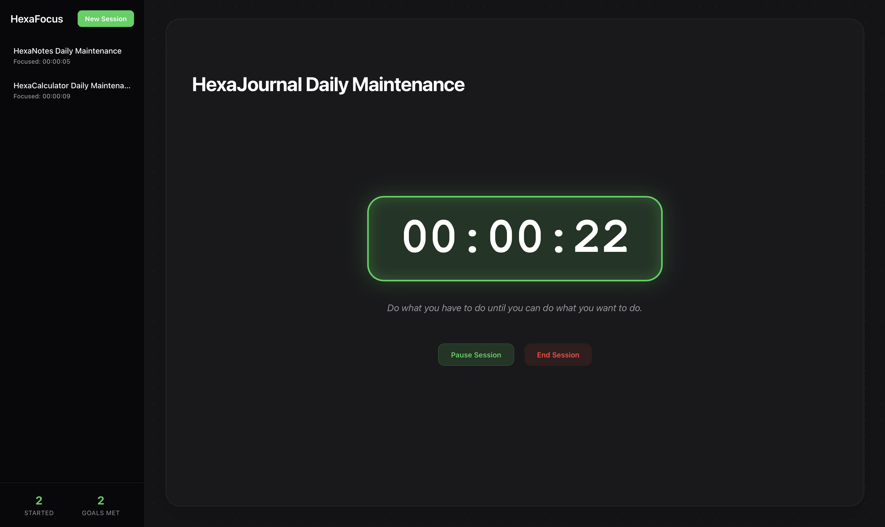

# HexaFocus

View HexaFocus at: https://hexa-programmer.github.io/HexaFocus/



HexaFocus is a minimal focus timer and session tracker built using HTML, CSS, and JavaScript.  
It runs entirely in the browser with no backend and uses localStorage for persistence.

---

## Features

    1) Focus Sessions: Create and start focused work sessions with a custom title.

    2) Live Stopwatch: Track your focus time with a real-time timer.

    3) Goal Tracking: Optionally set a goal and mark whether you achieved it.

    4) Session History: View previous sessions with duration, description, and results.

    5) Persistent Storage: All sessions are saved automatically using localStorage.

    6) Responsive Design: Optimized for both desktop and mobile devices.

---

## How it works

Each focus session is stored as an object:
```
    {
        id: Date.now(),
        title: "Session title",
        desc: "Optional description",
        goal: "Optional goal",
        durationSec: 0,
        status: "ended",
        goalAchieved: true
    }
```
All sessions are stored in browser storage using:
```
    localStorage
```
This allows session history to persist without any backend.

---

## Tech Stack

    - HTML5
    - CSS3
    - Vanilla JavaScript (no frameworks)

---

## Installation

To run HexaFocus locally:
```
    git clone https://github.com/Hexa-Programmer/HexaFocus.git
    cd HexaFocus
    open index.html
```
---

## Note

This is a personal learning project and will continue to evolve over time.

---

Made with ❤️ by Hexa-Programmer